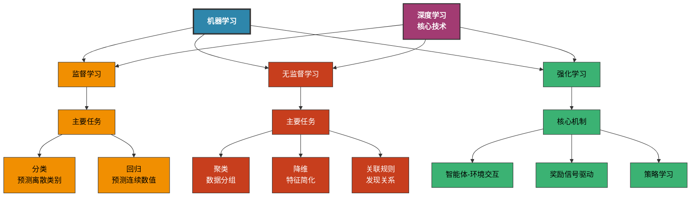
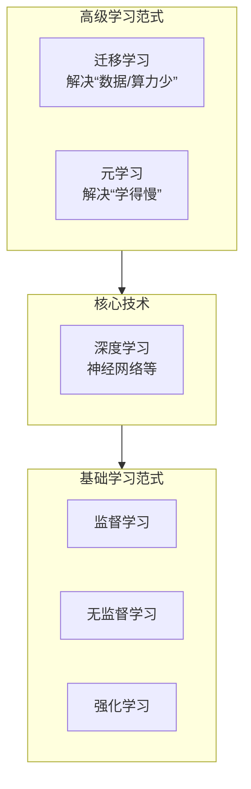

# 这里是我用来记录自己学习机器学习的项目

## 机器学习简介

机器学习是一种通过数据和经验来改进计算机性能的技术。它涉及算法和统计模型，使计算机系统能够自动从数据中学习和做出预测或决策，而无需明确编程。

## 项目结构

- `datasets/`：存放数据集的文件夹。
- `machine_learning/`：包含各个传统机器学习算法的详细程序，使用ipynb文件编写。
- `deep_learning/`：包含深度学习相关的程序和模型，使用ipynb文件编写。

## 机器学习分类

| 学习类型   | 解释                                                                                     |
| ---------- | ---------------------------------------------------------------------------------------- |
| 监督学习   | 如果我们的数据集是**有标签**的，那么我们把这种**学习任务**叫做监督学习。     |
| 无监督学习 | 如果我们的数据集是**没有标签**的，那么我们把这种学习任务叫做**无监督学习**。 |
| 强化学习   | 这种学习任务是通过**智能体与环境**的交互来进行学习的一种学习任务。                 |

# 各种学习之间的关系
