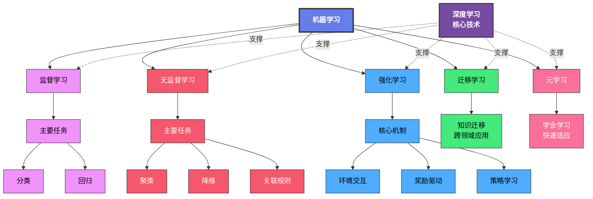

# 这里是我用来记录自己学习机器学习的项目

## 机器学习简介

机器学习是一种通过数据和经验来改进计算机性能的技术。它涉及算法和统计模型，使计算机系统能够自动从数据中学习和做出预测或决策，而无需明确编程。

## 项目结构

- `datasets/`：存放数据集的文件夹。
- `machine_learning/`：包含各个传统机器学习算法的详细程序，使用ipynb文件编写。
- `deep_learning/`：包含深度学习相关的程序和模型，使用ipynb文件编写。

## 机器学习分类

| 学习类型   | 解释                                                                                     |
| ---------- | ---------------------------------------------------------------------------------------- |
| 监督学习   | 如果我们的数据集是**有标签**的，那么我们把这种**学习任务**叫做监督学习。     |
| 无监督学习 | 如果我们的数据集是**没有标签**的，那么我们把这种学习任务叫做**无监督学习**。 |
| 强化学习   | 这种学习任务是通过**智能体与环境**的交互来进行学习的一种学习任务。                 |
| 迁移学习   | 通过将从一个任务中学到的知识应用到另一个相关任务中来提高学习效率和性能。             |
| 元学习     | 也称为“学习的学习”，旨在使模型能够快速适应新任务，通常通过少量的数据进行训练。     |
| 深度学习   | 基于人工神经网络的机器学习子领域，擅长处理复杂数据如图像和语音。                     |

## 机器学习概念图

## 本项目涵盖的内容

1. 算法实现：
    - KNN算法
    - 线性回归算法
    - 逻辑回归算法

2. 基于Pytorch实现深度学习

## 贡献

欢迎任何形式的贡献！如果你有好的想法或改进建议，请随时提交Pull Request或在Issues中提出。
## 许可证
本项目采用MIT许可证，详情请参阅LICENSE文件。
## 联系方式
如果你有任何问题或建议，可以通过以下方式联系我：
- 邮箱: [x1458786495@163.com]
- 微信: [T900564]
- QQ: [1458786495]

感谢你的关注和支持！祝你学习愉快！
