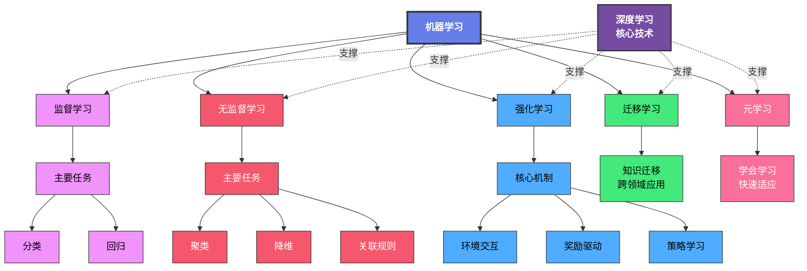

# 这里是我用来记录自己学习机器学习的项目

## 机器学习简介

机器学习是一种通过数据和经验来改进计算机性能的技术。它涉及算法和统计模型，使计算机系统能够自动从数据中学习和做出预测或决策，而无需明确编程。

## 项目结构

- `datasets/`：存放数据集的文件夹。
- `machine_learning/`：包含各个传统机器学习算法的详细程序，使用ipynb文件编写。
- `deep_learning/`：包含深度学习相关的程序和模型，使用ipynb文件编写。

## 机器学习分类

| 学习类型   | 解释                                                                                     |
| ---------- | ---------------------------------------------------------------------------------------- |
| 监督学习   | 如果我们的数据集是**有标签**的，那么我们把这种**学习任务**叫做监督学习。     |
| 无监督学习 | 如果我们的数据集是**没有标签**的，那么我们把这种学习任务叫做**无监督学习**。 |
| 强化学习   | 这种学习任务是通过**智能体与环境**的交互来进行学习的一种学习任务。                 |
| 迁移学习   | 通过将从一个任务中学到的知识应用到另一个相关任务中来提高学习效率和性能。             |
| 元学习     | 也称为“学习的学习”，旨在使模型能够快速适应新任务，通常通过少量的数据进行训练。     |
| 深度学习   | 基于人工神经网络的机器学习子领域，擅长处理复杂数据如图像和语音。                     |

## 机器学习概念图

## 本项目涵盖的内容

1. 算法实现：
    - KNN算法
    - 线性回归算法
    - 逻辑回归算法

2. 基于Pytorch实现深度学习

## 基本概念：

概念|解释
---|---
数据集| 所有的数据组合起来的集合就叫数据集。
训练集|用来训练模型的数据
测试集|用来检测模型性能的数据，也有可能是用来让模型进行预测的数据。（必须是模型未见过的数据）
验证集|用来调参的数据集，一般在训练集中选取的。
示例（instance）|是指训练数据的类别标记之前的内容。
样例(example)|包含类别标记的内容
样本（sample）|一行数据作为一个样本
特征|又叫属性、一列数据是一类特征
属性值|特征（属性）对应的每一个值。
属性空间/样本空间/输入空间|特征构成的一个空间叫做属性空间
特征向量|每一个属性对应的向量叫做特征向量
标签/目标/输出|最终需要得到的结果
标记空间/输出空间|所有的结果组成的空间。
假设|我们通过每一个算法训练出来的一个模型找出来的某一种规律（比如说判断一个西瓜是好的还是坏的）而这个规律不一定是正确的，因此，这个规律就叫做假设。
真相|对于一个问题，我们可以获得很多个假设，但是其中的是真正正确的，这个正确的规律就叫做真相。
学习器|就是模型。
分类|做离散型标签预测的任务
回归|做连续型标签预测的任务
二分类|标签只有两个类别的分类任务
多分类|标签有多个类别的分类任务
正类|在二分类任务中，我们把我们关注的类别叫做正类
负类|在二分类任务中，我们把不关注的类别叫做负类
监督学习|这是我们的学习任务划分，如果我们的数据集是有标签的，那么我们把这种学习任务叫做监督学习。一般是分类或者回归任务。
无监督学习|如果数据集是没有标签的，那么我们把这种学习任务叫做无监督学习。一般是聚类或者密度估计任务。
半监督学习|如果数据集中有一部分数据是有标签的，另一部分数据是没有标签的，那么我们把这种学习任务叫做半监督学习。
强化学习|这种学习任务是通过智能体与环境的交互来进行学习的一种学习任务。
深度学习|深度学习是机器学习的一个分支，主要通过多层神经网络来进行特征提取和模式识别。
未见样本|在训练过程中没有出现过的样本。我们假定了一个数据背后存在某种规律，我们希望通过训练数据学习到这个规律，从而对未见样本进行预测。具体这个分布是什么？我们并不知道，我们只能假设训练数据和未见样本是来自同一个分布。这就叫未知分布假设。在目前初步的机器学习课程学习当中，我们假设训练数据和未见样本是独立同分布的（i.i.d.假设）。
泛化（generalization）| 数据集在非训练数据上的表现好坏的能力。
参数|模型中需要学习的变量。
超参数|在模型训练之前需要设定的算法的参数，不能通过训练数据学习得到，需要人为手动规定的。

## 机器学习建模流程

1. 获取数据

   - 图像数据、文本数据、数值数据等

2. 数据预处理

   - 缺失值处理
   - 异常值处理
   - 重复值处理

3. 特征工程

   - 特征提取
   - 特征预处理（量纲统一）
   - 特征降维
   - 特征选取
   - 特征组合

4. 训练集划分

   - 按照比例或者不同方法将数据集划分成训练集、验证集、测试集
5. 模型训练

   - 线性回归
   - 逻辑回归
   - 决策树
   - GBDT
   - 等算法

6. 模型评估

   - 回归评测指标
   - 分类评测指标
   - 聚类评测指标

7. 模型预测

## 特征工程：

- 利用专业背景知识和技巧处理数据，让机器学习算法效果最好。这个过程就是特征工程。

步骤|解释
---|---
特征构建|从原始数据中人工的找出一些具有物理意义的特征。
特征提取|从原始数据中提取与任务相关的特征，构成特征向量，改变原数据
特征预处理|特征对模型产生影响;防止因量纲问题（单位），导致鲁棒性较差，有些特征对模型影响大，有些影响少。一般通过归一化或者标准化进行预处理。
特征降维|降低原始数据的维度。
特征选择|原始数据特征众多，与任务相关是其中一个特征集合子集，不会改变原数据。
特征组合|把多个特征合并成一个特征。利用乘法或者加法完成。例如：BMI。

## 模型拟合问题

名词|解释|可能原因
---|---|---
拟合(fitting)|用在机器学习领域，用来表示模型对样本点的拟合情况。|
欠拟合(under-fitting)| 模型在训练集和测试集上表现都差。|模型过于简单
过拟合(over-fitting)| 训练集表现良好，但是在测试集上表现很差。|模型过于复杂、数据不纯、训练数据太少
泛化（generalization）|数据集在非训练数据上的表现好坏的能力|
奥卡姆剃刀原则|如果多个模型相同泛化误差，选择较为简单的模型。|

## 贡献

欢迎任何形式的贡献！如果你有好的想法或改进建议，请随时提交Pull Request或在Issues中提出。
## 许可证
本项目采用MIT许可证，详情请参阅LICENSE文件。
## 联系方式
如果你有任何问题或建议，可以通过以下方式联系我：
- 邮箱: [x1458786495@163.com]
- 微信: [T900564]
- QQ: [1458786495]

感谢你的关注和支持！祝你学习愉快！

